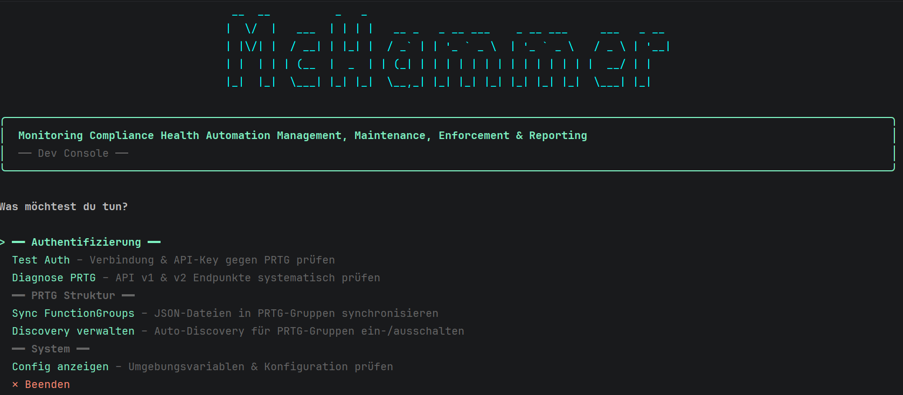
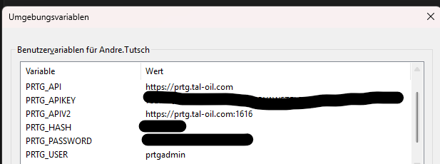
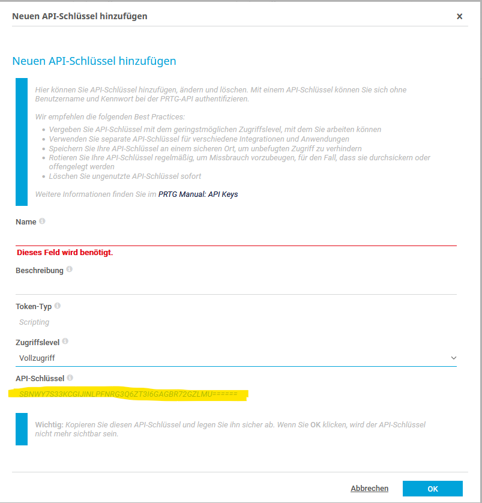
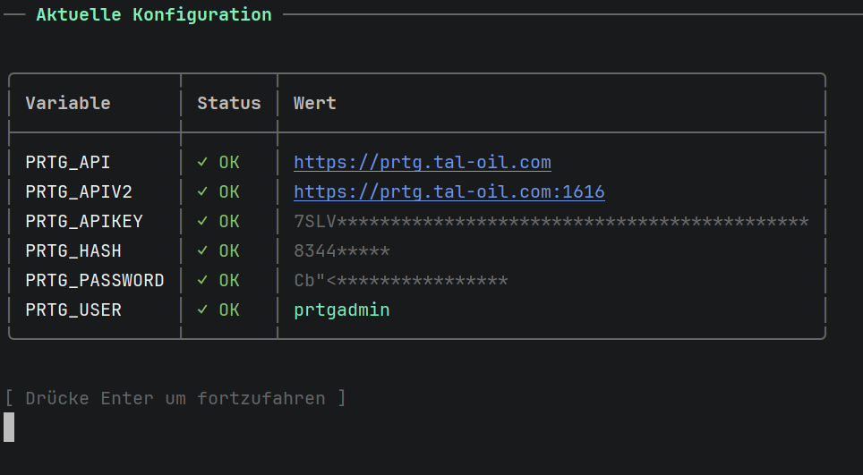
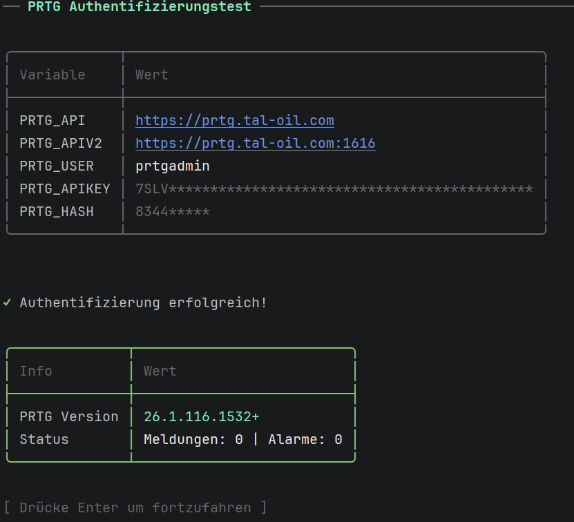
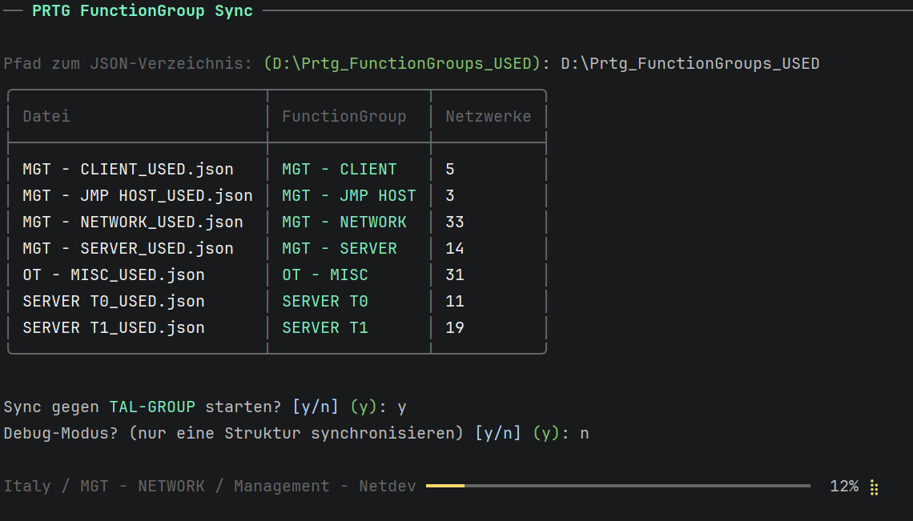
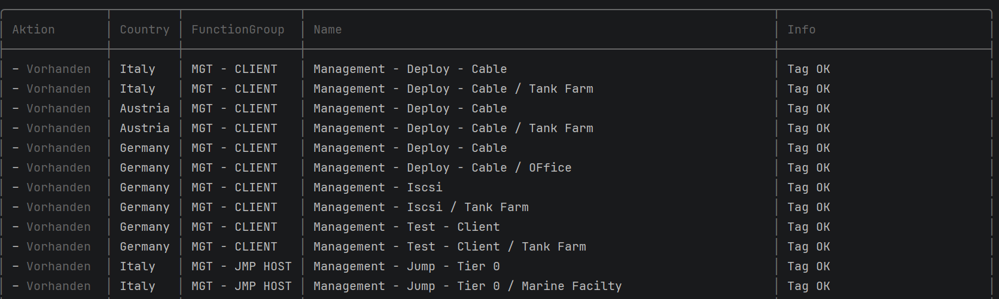
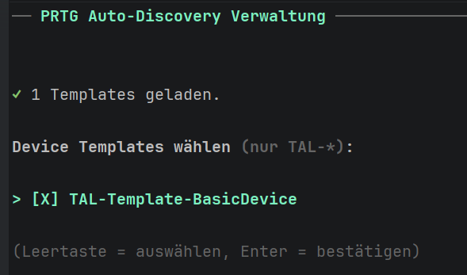
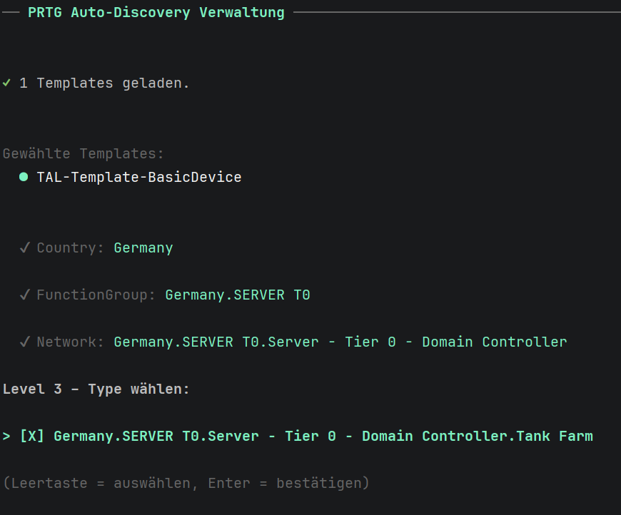

# McHammer — Benutzerhandbuch

> **Version:** 1.0  
> **Stand:** 26. März 2026  
> **Komponenten:** M.c.H.a.m.m.e.r. (Monitoring Compliance Health Automation Management, Maintenance, Enforcement & Reporting)  
> **Zielgruppe:** TAL Oil IT-Administration


---

## Inhaltsverzeichnis

1. [Überblick](#1-überblick)
2. [Umgebungsvariablen einrichten](#2-umgebungsvariablen-einrichten)
3. [McHammer Dev Console](#3-mchammer-dev-console)
4. [Config anzeigen](#4-config-anzeigen)
5. [Authentifizierung testen](#5-authentifizierung-testen)
6. [Diagnose PRTG](#6-diagnose-prtg)
7. [Sync FunctionGroups](#7-sync-functiongroups)
8. [Discovery verwalten](#8-discovery-verwalten)
9. [McHammer API](#9-mchammer-api)
10. [Fehlerbehebung & FAQ](#10-fehlerbehebung--faq)

---

## 1. Überblick

McHammer ist ein Kommandozeilen-Werkzeug zur automatisierten Verwaltung der PRTG-Monitoring-Struktur bei TAL Oil. Es besteht aus zwei Komponenten:




### Was kann McHammer?

- Netzwerkinventar (JSON-Dateien) mit PRTG synchronisieren
- Gruppen automatisch anlegen und pflegen
- Auto-Discovery für einzelne oder mehrere Gruppen aktivieren und deaktivieren
- Gerätevorlagen (TAL-Templates) zuweisen
- Konfiguration und Verbindung zu PRTG prüfen

---

## 2. Umgebungsvariablen einrichten

McHammer liest alle Verbindungsdaten aus **Umgebungsvariablen**. Es werden keine Passwörter oder Keys in Konfigurationsdateien gespeichert.

### Benötigte Variablen

| Variable | Pflicht | Beschreibung |
|---|---|---|
| `PRTG_API` | ✅ | URL der PRTG-Instanz (v1 API) |
| `PRTG_APIV2` | ✅ | URL des PRTG Application Servers (v2 API) |
| `PRTG_APIKEY` | ✅ | API-Key aus PRTG (empfohlen) |
| `PRTG_USER` | ⚠️ | Benutzername (nur wenn kein API-Key) |
| `PRTG_HASH` | ⚠️ | Passhash (nur wenn kein API-Key) |
| `PRTG_PASSWORD` | ⚠️ | Passwort (nur wenn kein API-Key) |

> ⚠️ Es wird empfohlen ausschließlich `PRTG_APIKEY` zu verwenden. Benutzername und Passwort sind nur als Fallback vorgesehen.

### Variablen setzen — Windows (dauerhaft)

1. **Windows-Taste** drücken, `Umgebungsvariablen` eingeben und öffnen
2. Unter **Systemvariablen** → **Neu** klicken
3. Name und Wert eintragen, mit **OK** bestätigen
4. Für jede Variable wiederholen



Alternativ per PowerShell (als Administrator):

```powershell
[System.Environment]::SetEnvironmentVariable("PRTG_API",    "https://prtg.tal-oil.com",      "Machine")
[System.Environment]::SetEnvironmentVariable("PRTG_APIV2",  "https://prtg.tal-oil.com:1616",  "Machine")
[System.Environment]::SetEnvironmentVariable("PRTG_APIKEY", "IHR-API-KEY-HIER",               "Machine")
```

### API-Key in PRTG erstellen

1. In PRTG einloggen
2. **Setup** → **API-Keys** → **API-Key hinzufügen**
3. Beschreibung eingeben (z.B. `McHammer`)
4. Rechte: mindestens **Lesen** und **Schreiben**
5. Key kopieren und als `PRTG_APIKEY` speichern



---

## 3. McHammer Dev Console

### Starten

```
D:\McHammer\McHammer.Dev\
Doppelklick auf: McHammer.Dev.exe

— oder per Kommandozeile —

cd D:\McHammer\McHammer.Dev
.\McHammer.Dev.exe
```

### Hauptmenü

Nach dem Start erscheint das Hauptmenü mit allen verfügbaren Funktionen:

```
  __  __      _   _                                        
 |  \/  | ___| | | | __ _ _ __ ___  _ __ ___   ___ _ __  
 | |\/| |/ __| |_| |/ _` | '_ ` _ \| '_ ` _ \ / _ \ '__| 
 | |  | | (__|  _  | (_| | | | | | | | | | | |  __/ |    
 |_|  |_|\___|_| |_|\__,_|_| |_| |_|_| |_| |_|\___|_|    

╭─────────────────────────────────────────────────────────────────╮
│  Monitoring Compliance Health Automation Management,            │
│  Maintenance, Enforcement & Reporting                           │
│  ── Dev Console ──                                              │
╰─────────────────────────────────────────────────────────────────╯

Was möchtest du tun?

── Authentifizierung ──
  Test Auth          – Verbindung & API-Key gegen PRTG prüfen
  Diagnose PRTG      – API v1 & v2 Endpunkte systematisch prüfen

── System ──
  Config anzeigen    – Umgebungsvariablen & Konfiguration prüfen

── PRTG Struktur ──
  Sync FunctionGroups – JSON-Dateien in PRTG-Gruppen synchronisieren
  Discovery verwalten – Auto-Discovery für PRTG-Gruppen ein-/ausschalten

  ✕ Beenden
```

### Navigation

| Taste | Aktion |
|---|---|
| `↑` / `↓` | Menüpunkt auswählen |
| `Enter` | Auswahl bestätigen |
| `Leertaste` | Bei Mehrfachauswahl: auswählen / abwählen |
| `Strg+C` | Abbrechen / Beenden |

---

## 4. Config anzeigen

### Zweck

Zeigt alle konfigurierten Umgebungsvariablen und deren Status an. Sensitive Werte (API-Key, Passhash) werden automatisch maskiert.

### Aufrufen

Hauptmenü → **System** → **Config anzeigen**

### Ausgabe


> ✅ Wenn `PRTG_API`, `PRTG_APIV2` und `PRTG_APIKEY` alle grün sind, ist McHammer korrekt konfiguriert. Die übrigen Variablen sind optional.



---

## 5. Authentifizierung testen

### Zweck

Stellt eine echte Verbindung zu PRTG her und prüft ob der API-Key gültig ist. Zeigt PRTG-Version und Systemstatus an.

### Aufrufen

Hauptmenü → **Authentifizierung** → **Test Auth**

### Erfolgreiche Ausgabe

```
╭──────────────┬──────────────────────────────────╮
│ PRTG_API     │ https://prtg.tal-oil.com          │
│ PRTG_USER    │ prtgadmin                         │
│ PRTG_APIKEY  │ 7SLV****                          │
╰──────────────┴──────────────────────────────────╯

✓ Authentifizierung erfolgreich!

╭──────────────┬────────────────────────────────────╮
│ PRTG Version │ 24.3.100.1234                      │
│ Status       │ Meldungen: 0 | Alarme: 2           │
╰──────────────┴────────────────────────────────────╯
```

### Fehlermeldung

```
✗ HTTP 401 – Unauthorized
  Tipp: Prüfe ob PRTG_APIKEY korrekt gesetzt ist.
        Format: langer Hash aus PRTG → Setup → API-Keys
```



---

## 6. Diagnose PRTG

### Zweck

Prüft systematisch alle von McHammer verwendeten API-Endpunkte — sowohl v1 als auch v2. Nützlich bei Verbindungsproblemen oder nach PRTG-Updates.

### Aufrufen

Hauptmenü → **Authentifizierung** → **Diagnose PRTG**

### Ausgabe

```
── API v1 (https://prtg.tal-oil.com) ──────────────────────────
┌─────────────────────┬────────┬───────┬───────────────────────┐
│ Endpunkt            │ Status │ Zeit  │ Antwort (Vorschau)    │
├─────────────────────┼────────┼───────┼───────────────────────┤
│ getversion.htm      │ 200    │ 42ms  │ {"version":"24.3.1…"} │
│ getstatus.htm       │ 200    │ 38ms  │ {"Version":"24.3…"}   │
│ table.json (groups) │ 200    │ 91ms  │ {"groups":[…]}        │
└─────────────────────┴────────┴───────┴───────────────────────┘

── API v2 (https://prtg.tal-oil.com:1616) ──────────────────────
┌────────┬───────────────────────────┬────────┬──────┐
│ POST   │ /experimental/groups/…    │ 400    │ 8ms  │
└────────┴───────────────────────────┴────────┴──────┘
```

### Statuscodes verstehen

| Code | Farbe | Bedeutung |
|---|---|---|
| `200` / `201` | 🟢 Grün | Endpunkt erreichbar und funktionsfähig |
| `400` | 🟡 Gelb | Endpunkt existiert — Anfrage fehlerhaft (oft erwartet bei Tests) |
| `401` / `403` | 🟡 Gelb | Authentifizierung fehlgeschlagen |
| `404` | 🔴 Rot | Endpunkt nicht gefunden |
| `ERR` | 🔴 Rot | Netzwerkfehler — Server nicht erreichbar |

> **Hinweis:** Ein `400` auf v2-Endpunkten bei der Diagnose ist **normal** — der Test sendet absichtlich ungültige Daten um zu prüfen ob der Endpunkt existiert.


---

## 7. Sync FunctionGroups

### Zweck

Liest alle Netzwerksegmente aus den JSON-Inventardateien und gleicht sie mit der PRTG-Gruppenstruktur ab. Neue Segmente werden angelegt, veraltete werden markiert.

### Voraussetzungen

- JSON-Dateien liegen im Verzeichnis `D:\Prtg_FunctionGroups_USED\` vor
- Jede Datei folgt dem Namensschema `*_USED.json`
- PRTG-Verbindung funktioniert (Test Auth erfolgreich)


### Aufrufen

Hauptmenü → **PRTG Struktur** → **Sync FunctionGroups**

---

### Schritt 1 — Verzeichnis angeben

```
Pfad zum JSON-Verzeichnis: (D:\Prtg_FunctionGroups_USED):
```

Standardpfad mit `Enter` bestätigen oder einen anderen Pfad eingeben.

---

### Schritt 2 — Übersicht der Dateien

McHammer zeigt alle gefundenen JSON-Dateien mit ihrer Netzwerkanzahl:

```
┌──────────────────────────┬───────────────┬───────────┐
│ Datei                    │ FunctionGroup │ Netzwerke │
├──────────────────────────┼───────────────┼───────────┤
│ SERVER_T0_USED.json      │ SERVER T0     │ 42        │
│ SERVER_T1_USED.json      │ SERVER T1     │ 38        │
│ MGT_SERVER_USED.json     │ MGT - SERVER  │ 17        │
└──────────────────────────┴───────────────┴───────────┘
```

---

### Schritt 3 — Sync bestätigen

```
Sync gegen TAL-GROUP starten? [y/n] (y):
```

Mit `y` + `Enter` bestätigen.

---

### Schritt 4 — Debug-Modus (optional)

```
Debug-Modus? (nur eine Struktur synchronisieren) [y/n] (n):
```

**Normaler Betrieb:** `n` eingeben — alle Segmente werden synchronisiert.

**Debug-Modus** (`y`): Ermöglicht die Auswahl eines einzelnen Segments für Tests:

```
Level 0 – Country wählen:    Germany
Level 1 – FunctionGroup:     SERVER T0
Level 2 – Network:           Server - Tier 0 - Domain Controller
```

> ⚠️ Im Debug-Modus werden **keine** bestehenden Gruppen fälschlicherweise archiviert — die Archivierungsprüfung erfolgt immer gegen alle JSON-Dateien.

---

### Schritt 5 — Synchronisation läuft

```
Germany / SERVER T0 / Server - Tier 0 - Domain Controller
━━━━━━━━━━━━━━━━━━━━━━━━  67% ⣻
```

Der aktuelle Fortschritt wird als Balken angezeigt. Das aktuell verarbeitete Segment erscheint als Beschriftung.

---

### Schritt 6 — Ergebnis

```
┌──────────────┬─────────┬───────────────┬─────────────────────────┬────────────────┐
│ Aktion       │ Country │ FunctionGroup │ Name                    │ Info           │
├──────────────┼─────────┼───────────────┼─────────────────────────┼────────────────┤
│ ✓ Erstellt   │ Germany │ SERVER T0     │ Server - Tier 0 - DC    │ VLAN: 183 │ … │
│ – Vorhanden  │ Germany │ SERVER T0     │ Server - Tier 0 - DC    │ Tag OK         │
│ ⚠ Archiviert │ ?       │ ?             │ Altes Segment           │ ARCHIVED_DATA  │
└──────────────┴─────────┴───────────────┴─────────────────────────┴────────────────┘

✓ Erstellt: 12  – Vorhanden: 85  ⚠ Archiviert: 3
```

### Ergebnis-Aktionen verstehen

| Symbol | Aktion | Bedeutung |
|---|---|---|
| ✓ grün | `Erstellt` | Gruppe war nicht in PRTG — wurde neu angelegt |
| – grau | `Vorhanden` | Gruppe existierte bereits — keine Änderung nötig |
| ⚠ gelb | `Archiviert` | Gruppe in PRTG, aber nicht mehr im JSON — Tag `ARCHIVED_DATA` gesetzt |




---

### Was passiert im Hintergrund?

Beim Sync werden für jedes Netzwerksegment folgende Aktionen ausgeführt:

| Ebene | Aktion |
|---|---|
| Level 0 (Country) | Gruppe anlegen falls nicht vorhanden |
| Level 1 (FunctionGroup) | Gruppe anlegen falls nicht vorhanden |
| Level 2 (Name) | Gruppe anlegen + Tag `LIVE_DATA` + Anmerkung mit VLAN/IP/Standort |
| Level 3 (Type) | Gruppe anlegen + Tag `LIVE_DATA` + IP-Discovery-Parameter vorbelegen |

---

## 8. Discovery verwalten

### Zweck

Aktiviert oder deaktiviert die automatische Geräteerkennung (Auto-Discovery) für ausgewählte PRTG-Gruppen. Bei Aktivierung können Gerätevorlagen (TAL-Templates) zugewiesen werden.

### Aufrufen

Hauptmenü → **PRTG Struktur** → **Discovery verwalten**

---

### Schritt 1 — Discovery-Modus wählen

```
Discovery-Modus:

> ✕ Deaktivieren
  📋 Suche mit Device Templates
```

| Option | Beschreibung |
|---|---|
| **Deaktivieren** | Discovery wird für alle gewählten Gruppen ausgeschaltet |
| **Suche mit Device Templates** | Discovery wird aktiviert und TAL-Templates zugewiesen |

---

### Schritt 2 — Templates wählen (nur bei Aktivierung)

McHammer lädt die verfügbaren TAL-Templates direkt aus PRTG:

```
✓ 3 Templates geladen.

Device Templates wählen (nur TAL-*):
(Leertaste = auswählen, Enter = bestätigen)

> [x] TAL-Template-BasicDevice    Basis-Template
  [ ] TAL-Template-Server         Windows/Linux Server
  [ ] TAL-Template-Network        Switch/Router
```

Mehrere Templates können gleichzeitig ausgewählt werden.

---

### Schritt 3 — Scope wählen

```
Welche Gruppen betreffen?

> Alle Level-0 Gruppen
  Level-0 auswählen (Multiselect)
  Level-1 auswählen (nach Level-0)
  Level-2 auswählen (nach Level-1)
  Level-3 auswählen (nach Level-2)
```

| Option | Wann verwenden |
|---|---|
| **Alle Level-0 Gruppen** | Discovery für alle Länder gleichzeitig setzen |
| **Level-0 (Multiselect)** | Bestimmte Länder auswählen |
| **Level-1 (nach Level-0)** | Bestimmte Funktionsgruppen in gewählten Ländern |
| **Level-2 (nach Level-1)** | Bestimmte Netzwerksegmente |
| **Level-3 (nach Level-2)** | Gezielte Aktivierung auf Gerätetyp-Ebene (empfohlen) |

---

### Schritt 4 — Gruppen auswählen (mehrstufig)

Die Auswahl erfolgt schrittweise. Auf jeder Ebene wird der vollständige Pfad angezeigt damit die Orientierung erhalten bleibt:

```
Level 0 – Country filtern:
  [x] Germany
  [ ] Italy
  [ ] Austria

  ✔ Country: Germany

Level 1 – FunctionGroup filtern:
  [x] Germany.SERVER T0
  [ ] Germany.SERVER T1
  [ ] Germany.MGT - SERVER

  ✔ FunctionGroup: Germany.SERVER T0

Level 2 – Network filtern:
  [x] Germany.SERVER T0.Server - Tier 0 - Domain Controller
  [ ] Germany.SERVER T0.Server - Tier 0 - File Server

  ✔ Network: Germany.SERVER T0.Server - Tier 0 - Domain Controller

Level 3 – Type wählen:
  [x] Germany.SERVER T0.Server - Tier 0 - Domain Controller.Tank Farm
  [ ] Germany.SERVER T0.Server - Tier 0 - Domain Controller.Standard
```




---

### Schritt 5 — Übersicht und Bestätigung

Vor der Ausführung zeigt McHammer eine Zusammenfassung:

```
┌───┬────────────┬────────┐
│ # │ Gruppe     │ ObjId  │
├───┼────────────┼────────┤
│ 1 │ Tank Farm  │ 8478   │
│ 2 │ Tank Farm  │ 9102   │
└───┴────────────┴────────┘

Modus: Mit Templates  Gesamt: 2 Gruppe(n)

Discovery für 2 Gruppe(n) auf Mit Templates setzen? [y/n] (y):
```

---

### Schritt 6 — Ausführung und Ergebnis

```
Tank Farm ━━━━━━━━━━━━━━━━━━━━━━━━━━━━━━━━━━━━━━━━ 100%

── Diagnose (erste Gruppe) ──
┌────────────────┬──────────────────────────┬──────────────────────────────┐
│ Property       │ Gesetzter Wert           │ Zurückgelesener Wert         │
├────────────────┼──────────────────────────┼──────────────────────────────┤
│ discoverytype  │ 2                        │ 2                            │
│ devicetemplate │ TAL-Template-BasicDevice │ TAL-Template-BasicDevice.odt │
└────────────────┴──────────────────────────┴──────────────────────────────┘

✓ Erfolgreich: 2
```

Die Diagnose-Tabelle zeigt für die erste Gruppe den gesetzten und den von PRTG zurückgelesenen Wert — zur Bestätigung dass die Änderung erfolgreich übernommen wurde.


---

### Discovery deaktivieren

Gleicher Ablauf wie Aktivierung — im ersten Schritt **Deaktivieren** wählen. Es werden keine Templates abgefragt. Die bestehende Template-Zuweisung in PRTG bleibt erhalten und wird beim nächsten Aktivieren automatisch wieder verwendet.

---

## 9. McHammer API

> **Status:** In Entwicklung — noch nicht für den produktiven Einsatz freigegeben.

Die McHammer API ist eine Web-API auf Basis von ASP.NET Core. Sie wird als Grundlage für ein zukünftiges webbasiertes Frontend dienen und alle Funktionen von McHammer.Dev als HTTP-Endpunkte bereitstellen.

### Geplante Endpunkte

| Endpunkt | Beschreibung |
|---|---|
| `GET /api/status` | Verbindungsstatus zu PRTG prüfen |
| `POST /api/sync` | Synchronisation auslösen |
| `GET /api/groups` | PRTG-Gruppenstruktur abrufen |
| `PATCH /api/discovery/{id}` | Discovery für eine Gruppe setzen |

### Starten (Entwicklungsumgebung)

```
cd D:\McHammer\McHammer.Api
dotnet run

→ API verfügbar unter: http://localhost:5214
→ OpenAPI Dokumentation: http://localhost:5214/openapi
```

---

## 10. Fehlerbehebung & FAQ

---

### ❓ McHammer startet nicht

**Mögliche Ursache:** .NET 10 Runtime nicht installiert.

**Lösung:**
```
https://dotnet.microsoft.com/download/dotnet/10.0
→ .NET Runtime 10.0 herunterladen und installieren
```

---

### ❓ „Umgebungsvariable fehlt" beim Start

**Meldung:**
```
✗ Umgebungsvariable 'PRTG_API' fehlt.
```

**Lösung:** Umgebungsvariablen gemäß [Kapitel 2](#2-umgebungsvariablen-einrichten) einrichten. Nach dem Setzen muss das Terminal / die Konsole **neu gestartet** werden.

---

### ❓ „Authentifizierung erfolgreich" aber Sync schlägt fehl

**Mögliche Ursache:** API-Key hat keine Schreibrechte.

**Lösung:**
1. In PRTG: Setup → API-Keys → Key bearbeiten
2. Rechte auf **Lesen und Schreiben** setzen
3. Key ggf. neu generieren und `PRTG_APIKEY` aktualisieren

---

### ❓ Gruppen werden als „Archiviert" markiert obwohl sie im JSON sind

**Mögliche Ursache:** Debug-Modus aktiv mit nur einem ausgewählten Segment.

**Lösung:** Vollständigen Sync ohne Debug-Modus ausführen. Die Archivierungsprüfung prüft immer gegen alle JSON-Dateien — jedoch werden im Debug-Modus nur Kindgruppen der Root-Gruppe geprüft.

---

### ❓ „TAL-GROUP nicht gefunden" beim Sync

**Mögliche Ursache:** Die Root-Gruppe `TAL-GROUP` existiert nicht in PRTG oder der API-Key hat keinen Zugriff darauf.

**Lösung:**
1. In PRTG prüfen ob `TAL-GROUP` unter der korrekten Probe existiert
2. Diagnose PRTG ausführen und Endpunkt `table.json (groups)` prüfen
3. API-Key-Rechte überprüfen

---

### ❓ Discovery wird auf „Detailliert" gesetzt statt „Mit Gerätevorlagen"

**Mögliche Ursache:** Veraltete Version von McHammer im Einsatz.

**Lösung:** Aktuelle Version von McHammer einspielen. Der korrekte Discovery-Typ-Wert ist `2` (Mit Gerätevorlagen), nicht `3` (Detailliert).

---

### ❓ Templates werden in der Auswahl nicht angezeigt

**Mögliche Ursache 1:** PRTG Application Server (v2 API) nicht erreichbar.

**Lösung:** Diagnose PRTG ausführen und v2-Endpunkte prüfen. Bei Bedarf PRTG Application Server aktivieren:
```
PRTG → Setup → System Administration → Application Server → Aktivieren
```

**Mögliche Ursache 2:** Vorlagen haben nicht das Präfix `TAL-`.

**Lösung:** Sicherstellen dass alle Vorlagendateien auf dem PRTG-Server mit `TAL-` beginnen.

---

### ❓ PRTG API v2 liefert 404 auf allen Endpunkten

**Mögliche Ursache:** `PRTG_APIV2` zeigt auf die falsche URL oder den falschen Port.

**Lösung:**
1. Prüfen ob der PRTG Application Server unter Port `1616` erreichbar ist
2. `PRTG_APIV2` auf `https://prtg.tal-oil.com:1616` setzen
3. Alternativ: im PRTG-Setup den tatsächlichen Port des Application Servers nachschlagen

---

### ❓ Sync dauert sehr lange

**Normales Verhalten:** Bei einem vollständigen Erstsync mit vielen Segmenten kann der Vorgang mehrere Minuten dauern, da für jedes Segment mehrere API-Aufrufe notwendig sind.

**Beschleunigung für Tests:** Debug-Modus verwenden und nur ein einzelnes Segment synchronisieren.

---

### Protokolldateien

McHammer schreibt derzeit keine Protokolldateien. Alle Ausgaben erscheinen direkt im Konsolenfenster. Es empfiehlt sich bei wichtigen Sync-Läufen die Ausgabe zu dokumentieren:

```powershell
.\McHammer.Dev.exe | Tee-Object -FilePath "sync-log-$(Get-Date -Format 'yyyy-MM-dd').txt"
```

---

*McHammer Benutzerhandbuch — TAL Oil — Stand März 2026*