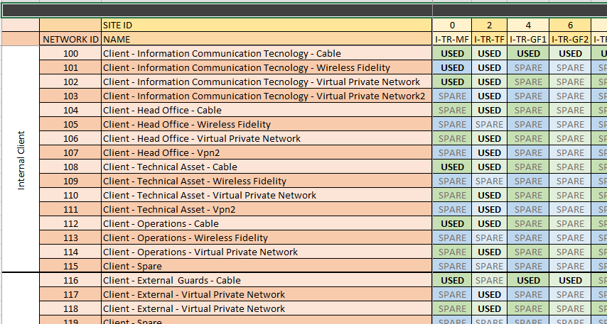
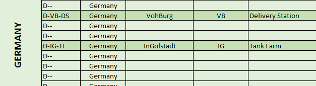
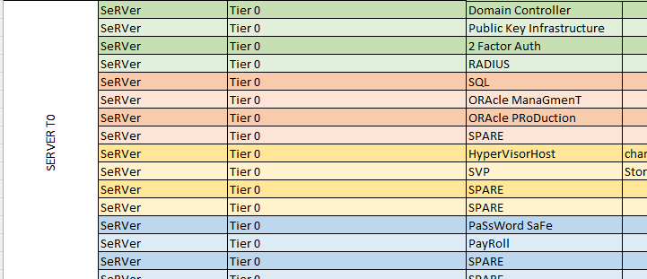
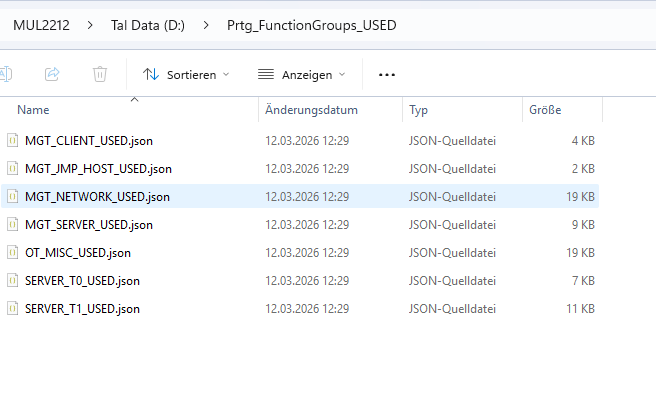
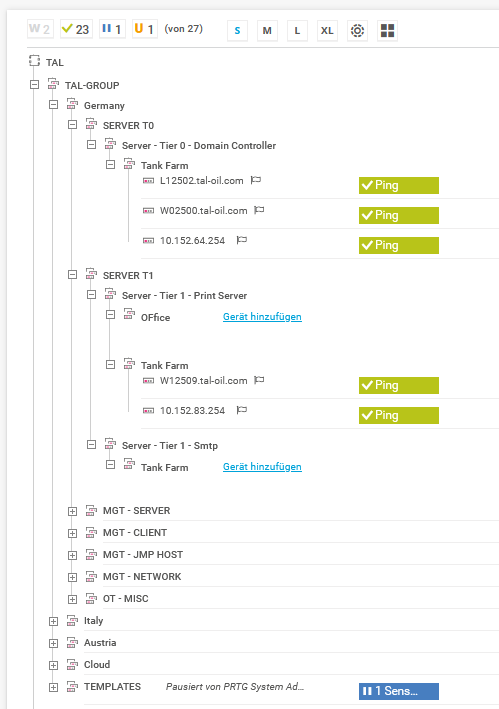
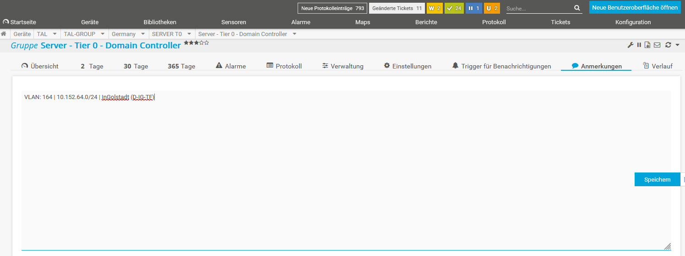
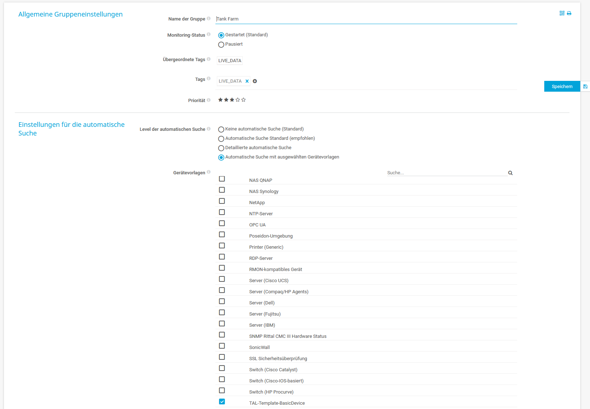
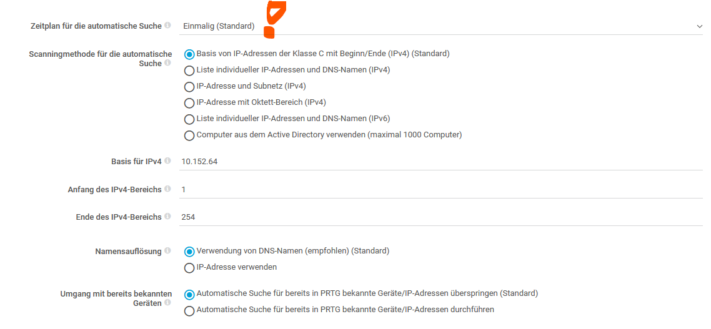
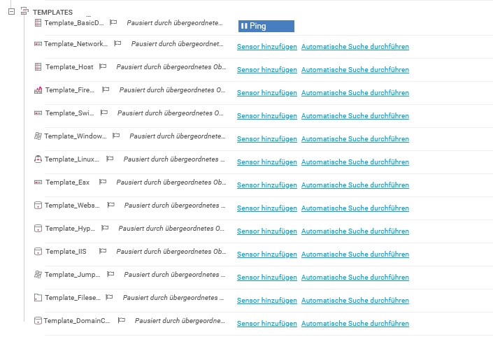

# Netzwerk-Monitoring Konzept
## TAL Oil — PRTG Network Monitor

> **Dokument-Version:** 1.0  
> **Stand:** 16. März 2026
> **Vertraulichkeit:** Intern / TAL Oil

---

## Inhaltsverzeichnis

1. [Einleitung & Zielsetzung](#1-einleitung--zielsetzung)
2. [Überblick: Wie funktioniert das Monitoring?](#2-überblick-wie-funktioniert-das-monitoring)
3. [Datengrundlage: Die Netzwerkinventarliste](#3-datengrundlage-die-netzwerkinventarliste)
4. [Workflow: Von der Liste ins Monitoring](#4-workflow-von-der-liste-ins-monitoring)
5. [Aufbau der Monitoring-Struktur in PRTG](#5-aufbau-der-monitoring-struktur-in-prtg)
6. [Automatische Geräteerkennung (Discovery)](#6-automatische-geräteerkennung-discovery)
7. [Gerätevorlagen (Device Templates)](#7-gerätevorlagen-device-templates)
8. [Verantwortlichkeiten](#8-verantwortlichkeiten)
9. [Glossar](#9-glossar)

---

## 1. Einleitung & Zielsetzung

TAL Oil betreibt Netzwerkinfrastruktur an zahlreichen Standorten in mehreren Ländern. Um den Überblick über diese verteilte Umgebung zu behalten, wird **PRTG Network Monitor** als zentrale Monitoring-Plattform eingesetzt.

### Was wird überwacht?

Das Monitoring erfasst die gesamte aktive Netzwerkinfrastruktur von TAL Oil:

- **Server** (Windows, Linux, iLO Management-Interfaces)
- **Netzwerkgeräte** (Switches, Router, Firewalls)
- **Standortanbindungen** und VLANs
- **Kritische Dienste** und Verfügbarkeit

### Ziele des Monitorings

| Ziel | Beschreibung |
|---|---|
| **Verfügbarkeit** | Ausfälle frühzeitig erkennen, bevor Nutzer betroffen sind |
| **Transparenz** | Jederzeit wissen, welche Geräte online und erreichbar sind |
| **Compliance** | Sicherstellen, dass alle definierten Netzwerksegmente überwacht werden |
| **Skalierbarkeit** | Neue Standorte und Segmente strukturiert und einheitlich integrieren |

---

## 2. Überblick: Wie funktioniert das Monitoring?

Das Monitoring bei TAL Oil ist **datengetrieben** — die Grundlage für alle Strukturen bildet eine vom Kunden gepflegte Netzwerkinventarliste. Aus dieser Liste wird automatisch die Monitoring-Struktur in PRTG abgeleitet.

Die Aufbereitung übernimmt hier **GraphITy**

<figure>
  
  <figcaption><em>GraphITy</em></figcaption>
</figure>

Die Synchronisation und Autmoatisierung **McHammer**


```
┌─────────────────────────────────────────────────────────────────┐
│                                                                 │
│   TAL Oil IT                                                    │
│   pflegt Netzwerkinventar                                       │
│   (Excel-Datei: Net_sites_ASS.xlsx)                             │
│                                                                 │
└───────────────────────┬─────────────────────────────────────────┘
                        │
                        ▼
┌─────────────────────────────────────────────────────────────────┐
│                                                                 │
│   Automatische Aufbereitung                                     │
│   Excel → strukturierte JSON-Dateien                            │
│   (eine Datei pro Funktionsgruppe)                              │
│                                                                 │
└───────────────────────┬─────────────────────────────────────────┘
                        │
                        ▼
┌─────────────────────────────────────────────────────────────────┐
│                                                                 │
│   Synchronisation in PRTG durch McHammer                        │
│   Gruppen & Struktur werden angelegt                            │
│   Neue Segmente → automatisch hinzugefügt                       │
│   Entfernte Segmente → als veraltet markiert                    │
│                                                                 │
└───────────────────────┬─────────────────────────────────────────┘
                        │
                        ▼
┌─────────────────────────────────────────────────────────────────┐
│                                                                 │
│   PRTG Network Monitor                                          │
│   Geräte werden erkannt & überwacht                             │
│   Alarme & Berichte                                             │
│                                                                 │
└─────────────────────────────────────────────────────────────────┘
```

Dieser Prozess stellt sicher, dass PRTG **immer den aktuellen Stand** der Netzwerkplanung von TAL Oil widerspiegelt — ohne manuelle Eingaben in PRTG.

---

## 3. Datengrundlage: Die Netzwerkinventarliste

### Was ist das?

Die Netzwerkinventarliste ist eine von der IT-Abteilung von TAL Oil gepflegte Excel-Datei, die alle relevanten Netzwerksegmente des Unternehmens beschreibt. Sie ist die **einzige Wahrheitsquelle** für die Monitoring-Struktur.

### Welche Informationen enthält sie?

Jede Zeile der Liste beschreibt ein Netzwerksegment mit folgenden Feldern:

| Feld | Beschreibung | Beispiel |
|---|---|---|
| **Land (Country)** | Standortland | `Germany`, `Italy`, `Austria` |
| **Funktionsgruppe (FunctionGroup)** | Art der Infrastruktur | `SERVER T0`, `MGT - SERVER` |
| **Name** | Bezeichnung des Segments | `Server - Tier 0 - Domain Controller` |
| **Typ (Type)** | Gerätetyp im Segment | `Tank Farm`, `Standard Server` |
| **Netzwerk** | IP-Adresse des Netzes | `10.134.83.0` |
| **Netzmaske** | Subnetzmaske | `255.255.255.0` |
| **VLAN** | VLAN-Kennung | `183` |
| **Standortcode** | Kurzbezeichnung des Standorts | `D-MU-OF` |
| **Stadt** | Standortstadt | `München` |
| **Status** | Aktiv / Inaktiv | `active` |

<figure>
  
  <figcaption><em>Excel Sites TAB</em></figcaption>
</figure>


<figure>
  
  <figcaption><em>Excel Location TAB</em></figcaption>
</figure>


<figure>
  
  <figcaption><em>Excel Function TAB</em></figcaption>
</figure>


### Wer pflegt die Liste?

> **Verantwortung: TAL Oil IT-Abteilung**

Die Liste wird von TAL Oil gepflegt und regelmäßig aktualisiert — beispielsweise wenn:
- neue Standorte in Betrieb genommen werden
- Netzwerksegmente geändert oder aufgeteilt werden
- Gerätetypen oder Funktionsgruppen umstrukturiert werden

### Was passiert bei Änderungen?

Sobald TAL Oil die Liste aktualisiert und bereitstellt, muss der Synchronisationsprozess ausgeführt werden. PRTG wird automatisch angepasst:

- **Neue Einträge** → neue Gruppen werden in PRTG angelegt
- **Geänderte Einträge** → werden beim nächsten Lauf berücksichtigt
- **Entfernte Einträge** → bestehende PRTG-Gruppen werden als `ARCHIVED_DATA` markiert und **nicht gelöscht** (Sicherheitsnetz)

Anhanf dieses TAGs können nicht mehr benötigte Gruppen einfach gelöscht werden. Dieser Vorgang ist nicht automatisiert und muss manuel angestoßen werden.

---

## 4. Workflow: Von der Liste ins Monitoring

### Schritt 1 — Inventar aktualisieren

TAL Oil aktualisiert die Excel-Datei mit dem aktuellen Netzwerkinventar und stellt sie bereit.

```
📄 Net_sites_ASS.xlsx
    (gepflegt von TAL Oil IT)
```

### Schritt 2 — Aufbereitung in JSON

Die Excel-Datei wird in strukturierte JSON-Dateien aufgeteilt — eine Datei pro Funktionsgruppe. Diese Dateien sind die Eingabe für den Synchronisationsprozess.

```
📁 Prtg_FunctionGroups_USED\
    ├── SERVER_T0_USED.json     → alle SERVER-T0-Segmente
    ├── SERVER_T1_USED.json     → alle SERVER-T1-Segmente
    ├── MGT_SERVER_USED.json    → alle Management-Server-Segmente
    └── ...
```

<figure>
  
  <figcaption><em>Explorer View</em></figcaption>
</figure>

### Schritt 3 — Synchronisation mit PRTG

Der Synchronisationsprozess liest alle JSON-Dateien und gleicht sie mit der bestehenden PRTG-Struktur ab:

```
Für jedes Netzwerksegment in den JSON-Dateien:

  Gibt es die Gruppe "Germany" in PRTG?
  ├── Nein → Gruppe anlegen
  └── Ja  → weiter

    Gibt es die Gruppe "SERVER T0" unter "Germany"?
    ├── Nein → Gruppe anlegen
    └── Ja  → weiter

      Gibt es das Segment "Server - Tier 0 - DC"?
      ├── Nein → Gruppe anlegen + Netzwerkdaten als Anmerkung speichern
      └── Ja  → prüfen ob Tag korrekt gesetzt ist

        Gibt es den Typ "Tank Farm" darunter?
        ├── Nein → Gruppe anlegen + IP-Discovery vorbereiten
        └── Ja  → keine Aktion nötig
```


Des weiteren werden die Netzwerkinformationen in das Anmerkungsfeld der Gruppe Dokumentiert.

### Schritt 4 — Discovery aktivieren

Nach der Synchronisation kann für ausgewählte Gruppen die **automatische Geräteerkennung** aktiviert werden. PRTG scannt dann das definierte Netzwerksegment und legt automatisch Geräte und Sensoren an.

Dieser Schritt erfolgt **kontrolliert und gezielt** — nicht automatisch für alle Gruppen auf einmal.

Die IP Bereiche werden automatisch aus der Excel-Liste ausgelesen.


### Schritt 5 — Überwachung läuft

Sobald Geräte erkannt und Sensoren angelegt wurden, überwacht PRTG die Infrastruktur kontinuierlich und löst Alarme aus wenn Schwellwerte überschritten werden oder Geräte nicht mehr erreichbar sind.
PRTG übernimmt das Discovery in dem angegebenen Bereich automatisch.

Über die Templates wird gesteuert, welche Sensoren für die Gruppe verwendet werden sollen.
---

## 5. Aufbau der Monitoring-Struktur in PRTG

### Prinzip

Die gesamte TAL Oil Infrastruktur ist in PRTG unter einer gemeinsamen Wurzelgruppe organisiert. Darunter wird eine einheitliche 4-stufige Hierarchie aufgebaut, die direkt aus der Netzwerkinventarliste abgeleitet wird.

### Die 4 Ebenen

```
TAL-GROUP                                    ← Wurzel (von TAL Oil verwaltet)
│
├── Germany                                  ← Ebene 0: Land
│   ├── SERVER T0                            ← Ebene 1: Funktionsgruppe
│   │   ├── Server - Tier 0 - Domain Ctrl.   ← Ebene 2: Netzwerksegment
│   │   │   └── Tank Farm                    ← Ebene 3: Gerätetyp
│   │   └── Server - Tier 0 - File Server
│   │       └── Standard Server
│   └── MGT - SERVER
│       └── Management - Srv-iLO
│           └── iLO Management
│
├── Italy
│   └── ...
│
└── Austria
    └── ...
```

<figure>
  
  <figcaption><em>Gruppenstruktur in PRTG unter TAL-GROUP</em></figcaption>
</figure>

### Was bedeutet jede Ebene?

**Ebene 0 — Land (Country)**
Fasst alle Infrastruktur eines Landes zusammen. Ermöglicht eine geografische Filterung und länderspezifische Auswertungen.

Auf dieser Ebene können Lokale Probes Installiert werden, sofern nötig.

**Ebene 1 — Funktionsgruppe (FunctionGroup)**
Beschreibt die Art der Infrastruktur unabhängig vom Standort. Beispiele: `SERVER T0` für Tier-0-Server, `MGT - SERVER` für Management-Schnittstellen. Diese Einteilung ermöglicht funktionsbezogene Auswertungen quer über alle Länder.

**Ebene 2 — Netzwerksegment (Name)**
Das konkrete Netzwerksegment mit IP-Bereich, VLAN und Standortinformation. In der PRTG-Anmerkung ist hinterlegt:
```
VLAN: 183 | 10.134.83.0/24 | München (D-MU-OF)
```


<figure>
  
  <figcaption><em>Anmerkung werden in PRTG übernommen</em></figcaption>
</figure>

**Ebene 3 — Gerätetyp (Type)**
Beschreibt welche Art von Geräten in diesem Segment zu erwarten sind (z.B. `Tank Farm`, `Standard Server`). Auf dieser Ebene wird die automatische Geräteerkennung konfiguriert und ausgeführt.

### Statusmarkierungen (Tags)

Alle Gruppen werden mit Tags versehen, die ihren aktuellen Synchronisationsstatus anzeigen:

| Tag | Bedeutung | Sichtbar in PRTG |
|---|---|---|
| `LIVE_DATA` | Segment ist aktiv im Inventar vorhanden | ✓ |
| `ARCHIVED_DATA` | Segment wurde aus dem Inventar entfernt | ✓ (zur Überprüfung) |

> Gruppen mit dem Tag `ARCHIVED_DATA` werden **nicht automatisch gelöscht**. Sie bleiben in PRTG sichtbar, damit TAL Oil prüfen kann ob historische Daten aufbewahrt werden sollen, bevor eine manuelle Löschung erfolgt.

Mit diesem Tag können die Gruppen/Geräte einfach gelöscht werden. Dieser Prozess MUSS manuel erfolgen.

---

## 6. Automatische Geräteerkennung (Discovery)

### Was ist die Discovery?

PRTG kann Netzwerksegmente automatisch nach erreichbaren Geräten durchsuchen. Wird ein Gerät gefunden, legt PRTG es automatisch an und fügt passende Überwachungssensoren hinzu — basierend auf dem Gerätetyp.

### Wie ist die Discovery bei TAL Oil konfiguriert?

Die Discovery erfolgt **nicht global und automatisch**, sondern wird **gezielt und kontrolliert** für einzelne Gruppen aktiviert. Dadurch wird sichergestellt, dass:

- keine unerwünschten Geräte ins Monitoring aufgenommen werden
- der Prozess nachvollziehbar und steuerbar bleibt
- Scans nur dann erfolgen, wenn ein Segment vollständig vorbereitet ist

### IP-Bereich

Der zu scannende IP-Bereich ist direkt aus dem Netzwerkinventar abgeleitet. Für jedes Segment sind in PRTG hinterlegt:

| Parameter | Beispiel | Bedeutung |
|---|---|---|
| IP-Basis | `10.134.83` | Die ersten drei Oktette des Netzwerks |
| Von | `1` | Startadresse des Scanbereichs |
| Bis | `254` | Endadresse des Scanbereichs |


<figure>
  
  <figcaption><em>PRTG Discovery Einstellungen</em></figcaption>
</figure>

<figure>
  
  <figcaption><em>PRTG Discovery Einstellungen</em></figcaption>
</figure>


### Discovery-Status

| Status | Beschreibung |
|---|---|
| **Deaktiviert** | Standardzustand nach Anlage. Kein Scan findet statt. |
| **Mit Gerätevorlagen** | Discovery ist aktiv. PRTG scannt und verwendet die zugewiesenen TAL-Templates. |

### Wann wird die Discovery aktiviert?

Die Discovery für ein Segment wird aktiviert, wenn:

1. Das Netzwerksegment im Inventar vorhanden und synchronisiert ist
2. Die passende Gerätevorlage (Template) zugewiesen wurde
3. TAL Oil die Freigabe für den Scan erteilt hat

---

## 7. Gerätevorlagen (Device Templates)

### Was sind Gerätevorlagen?

Gerätevorlagen (Device Templates) definieren, welche Sensoren PRTG bei der automatischen Erkennung auf einem Gerät anlegen soll. Sie stellen sicher, dass gleiche Gerätetypen immer mit den gleichen Sensoren überwacht werden — einheitlich und konsistent.

### TAL-spezifische Vorlagen

Alle bei TAL Oil verwendeten Vorlagen tragen das Präfix `TAL-`. Dies stellt sicher, dass nur vom Projekt freigegebene und geprüfte Templates eingesetzt werden.

Beispiele:

| Vorlage | Einsatzbereich |
|---|---|
| `TAL-Template-BasicDevice` | Allgemeine Grundüberwachung für Netzwerkgeräte |
| *(weitere nach Bedarf)* | |


<figure>
  
  <figcaption><em>PRTG Templates Einstellungen</em></figcaption>
</figure>


### Wer verwaltet die Vorlagen?

> **Verantwortung: gemeinsam**

Die Vorlagen werden **technisch** vom Monitoring-Team erstellt und auf dem PRTG-Server hinterlegt. Die **inhaltliche Entscheidung** — welche Sensoren für welchen Gerätetyp sinnvoll sind — erfolgt in Abstimmung mit TAL Oil.

### Vorlagen hinzufügen

Neue Vorlagen werden vom Monitoring-Team auf dem PRTG-Server eingespielt und stehen danach automatisch zur Verfügung. TAL Oil muss hierfür keinen Zugriff auf den Server haben.

### Vorlagen entfernen

Das Entfernen einer Vorlage erfordert einen direkten Eingriff auf dem PRTG-Server und wird ausschließlich vom Monitoring-Team durchgeführt. TAL Oil informiert das Team, wenn eine Vorlage nicht mehr benötigt wird.

> **Wichtig:** Wird eine Vorlage entfernt, bleiben bereits damit überwachte Geräte weiterhin aktiv. Nur neue Discovery-Läufe nutzen die Vorlage nicht mehr.

---

## 8. Verantwortlichkeiten

Aufgaben im Monitoring-Prozess:

| Aufgaben |
|---|
| Netzwerkinventar pflegen und aktualisieren |
| Neue Standorte / Segmente im Inventar erfassen |
| Freigabe für Discovery-Aktivierung erteilen |
| Benachrichtigung bei veralteten Segmenten (`ARCHIVED_DATA`) |
| JSON-Aufbereitung aus Excel-Inventar |
| Synchronisation mit PRTG ausführen |
| PRTG-Gruppenstruktur anlegen & pflegen |
| Discovery aktivieren / deaktivieren |
| Gerätevorlagen erstellen und pflegen |
| PRTG-Plattform betreiben und warten |
| Alarmierung und Eskalation konfigurieren |


Es wird empfohlen, Änderungen am Inventar dem Monitoring-Team **mindestens einen Werktag vor dem gewünschten Aktivierungsdatum** mitzuteilen, um die Synchronisation und Qualitätsprüfung rechtzeitig durchführen zu können.

---

## 9. Glossar

| Begriff | Erklärung |
|---|---|
| **PRTG** | Paessler PRTG Network Monitor — die eingesetzte Monitoring-Software |
| **Sensor** | Eine einzelne Überwachungsaufgabe in PRTG, z.B. "Ist der Server erreichbar?" oder "Wie hoch ist die CPU-Auslastung?" |
| **Gruppe** | Eine Ordnerstruktur in PRTG zur logischen Zusammenfassung von Geräten und Sensoren |
| **Discovery / Auto-Discovery** | Automatische Suche nach Geräten in einem definierten IP-Bereich durch PRTG |
| **Device Template** | Vorlage die festlegt, welche Sensoren bei der Discovery auf einem Gerät angelegt werden |
| **TAL-GROUP** | Die Wurzelgruppe in PRTG unter der die gesamte TAL Oil Infrastruktur organisiert ist |
| **FunctionGroup** | Funktionsbezeichnung einer Infrastrukturgruppe unabhängig vom Standort (z.B. SERVER T0) |
| **VLAN** | Virtual Local Area Network — logische Netzwerktrennung innerhalb der physischen Infrastruktur |
| **CIDR** | Kurzschreibweise für Netzwerkmasken, z.B. `/24` statt `255.255.255.0` |
| **LIVE_DATA** | Tag in PRTG der anzeigt, dass eine Gruppe aktiv im Inventar vorhanden ist |
| **ARCHIVED_DATA** | Tag in PRTG der anzeigt, dass eine Gruppe nicht mehr im Inventar vorhanden ist |
| **Synchronisation** | Automatischer Abgleich zwischen dem Netzwerkinventar (JSON) und der PRTG-Struktur |
| **iLO** | Integrated Lights-Out — Management-Interface von HP-Servern für Fernwartung |
| **Tier** | Qualitätsstufe von Servern (Tier 0 = kritisch, Tier 1 = standard, etc.) |

---

*Dieses Dokument beschreibt den Monitoring-Prozess für TAL Oil. Bei Fragen oder Änderungsbedarf wenden Sie sich an das Monitoring-Team.*